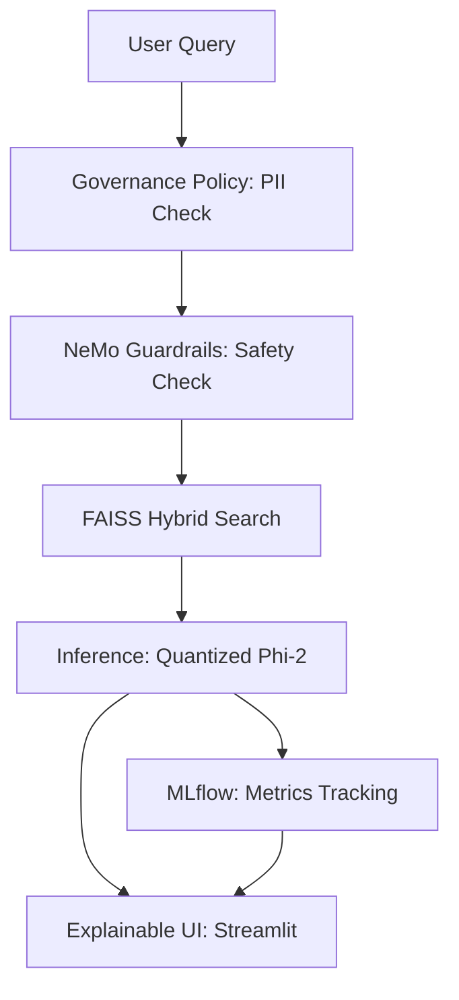

# 🏦 Capital One AI Assistant (Recruiter Edition)

A production-grade, safe, and optimized Retrieval-Augmented Generation (RAG) system designed for personal finance intelligence. This project demonstrates expertise in LLMs, MLOps, Governance, and AWS deployment, specifically tailored for the high standards of a **Senior Machine Learning Engineer** role at Capital One.

## 🚀 Key Features

- **Local LLM Optimization**: Uses `microsoft/phi-2` quantized to 4-bit with `bitsandbytes` for high-performance inference on consumer hardware.
- **NeMo Guardrails**: Integrated safety layer for topic enforcement and financial query validation.
- **Advanced Governance**: Real-time PII redaction and policy-based query filtering.
- **High-Impact MLOps**: Experiment tracking with MLflow, covering Latency, Throughput, Cost, and Safety metrics.
- **Explainable RAG**: Source-attribution and transparency in product recommendations.
- **RAGAS Evaluation**: Automated quality scoring for Faithfulness and Relevancy.

## 🛠️ Architecture & Structure

- `core/`: RAG engine and safety guardrails.
- `inference/`: Model quantization and optimization logic.
- `governance/`: PII redaction and data access policies.
- `mlops/`: Experiment tracking and latency monitoring.
- `experiments/`: A/B testing framework.
- `aws/`: SageMaker deployment scripting.
- `data/`: Curated financial product datasets.

## 📊 Performance Dashboard

The Streamlit UI provides a real-time view of:
- **Latency**: End-to-end response time.
- **Throughput**: Requests processed per second.
- **Cost Efficiency**: Tokens per dollar for the local model.
- **Quality**: RAGAS accuracy scores.
- **Safety**: Guardrail trigger rates.

## 🚦 Getting Started

1. **Install Dependencies**: `pip install -r requirements.txt`
2. **Start Backend**: `uvicorn api.main:app --reload`
3. **Start Frontend**: `streamlit run ui/streamlit_app.py`

## 🏆 Portfolio Highlight
This project implements the full lifecycle of a regulated AI product: from **local optimization** and **safe retrieval** to **automated evaluation** and **cloud-ready deployment scripts**.
